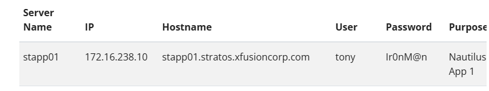
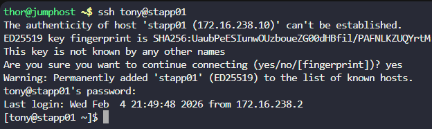
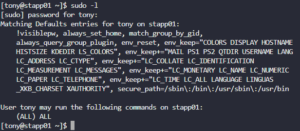
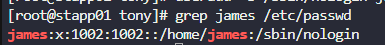

# Overview

To accommodate the backup agent tool's specifications, the system admin team at `xFusionCorp Industries` requires the creation of a user with a non-interactive shell. Here's your task:  

Create a user named `james` with a non-interactive shell on `App Server 1`.

# Solution

We are automatically logged in as a user called `thor` which is on the jump_host server. We will need to ssh into a user who is on  `App Server 1`  

We are given a list of all users with their passwords and server they're located on, which can be accessed here:
https://kodekloudhub.github.io/kodekloud-engineer/docs/projects/nautilus#infrastructure-details

Looking at the link, there is only 1 user on `App Server 1` - This is `tony`

We need to ssh into the `tony` user:
`ssh tony@stapp01`

Enter password
`Ir0nM@n`

We are now logged in as Tony

Trying to run:
`useradd -s /sbin/nologin james` - This gives a permission denied, which means tony does not have the correct permissions to create an account. We will need to escalate to root

Running `sudo -l` - Shows we have ALL commands, which refers to the complete set of executable instructions available in the system's command-line interface (CLI), which can be used to manage files, processes, users, networks, and system resources

Running `sudo su` - Escalates the user `tony` to `root`

Now we run the useradd command again:
`useradd -s /sbin/nologin james` 

To verify we can run:
`grep james /etc/passwd`

The account has now been created
