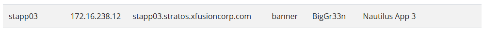
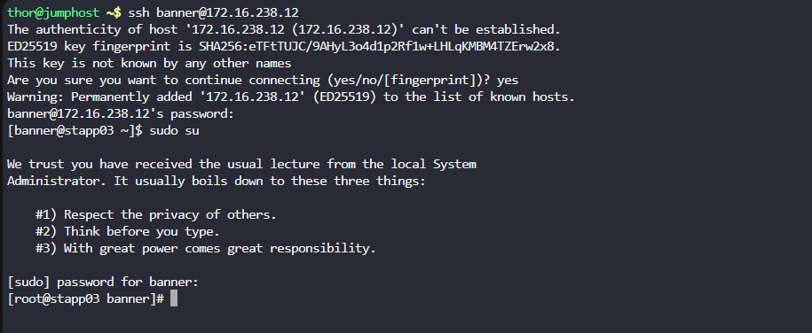
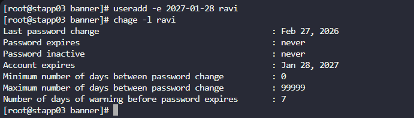

# Overview

As part of the temporary assignment to the `Nautilus` project, a developer named `ravi` requires access for a limited duration. To ensure smooth access management, a temporary user account with an expiry date is needed. Here's what you need to do:  

Create a user named `ravi` on `App Server 3` in Stratos Datacenter. Set the expiry date to `2027-01-28`, ensuring the user is created in lowercase as per standard protocol.

# Solution

We are automatically logged in as a user called `thor` which is on the jump_host server. We will need to ssh into a user who is on  `App Server 3`  

We are given a list of all users with their passwords and server they're located on, which can be accessed here:
https://kodekloudhub.github.io/kodekloud-engineer/docs/projects/nautilus#infrastructure-details

We can see that banner is on `Nautilus App 3` - We will need to shh into this user

```sh
ssh banner@172.16.238.12
```

Enter password:
`BigGr33n`

Once we have logged in, we need to run `sudo su` to change the user to root to have superadmin privileges


Now, the user needs to be created with the expiry date, to do this run the command:
```sh
useradd -e 2027-01-28 ravi
```

To verify the user has been created and the expiry date is set, this command can be run:
```sh
chage -l ravi
```


We can now see that the user account has been created and will expire on Jan 28 2027
