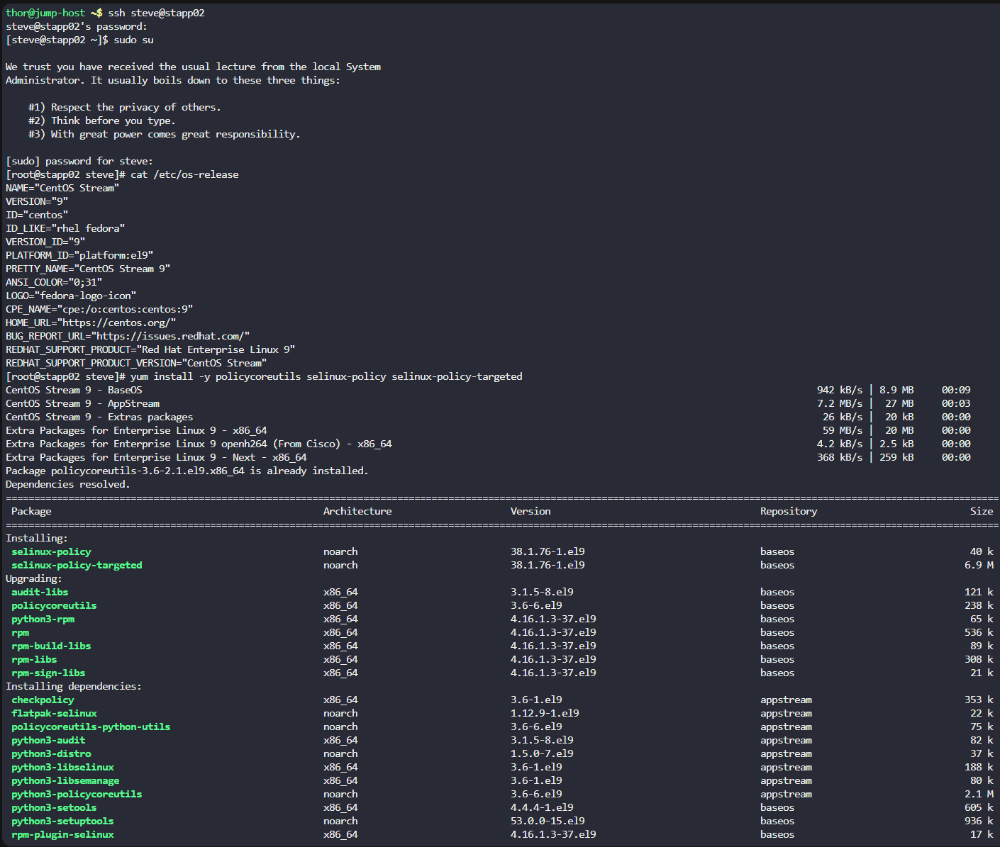
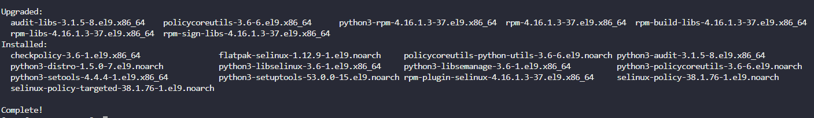
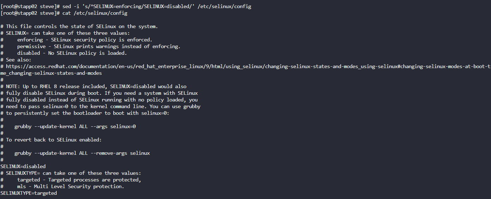

# Overview

Following a security audit, the xFusionCorp Industries security team has opted to enhance application and server security with SELinux. To initiate testing, the following requirements have been established for `App server 2` in the `Stratos Datacenter:`  
  
1. Install the required `SELinux` packages.
    
2. Permanently disable SELinux for the time being; it will be re-enabled after necessary configuration changes.
    
3. No need to reboot the server, as a scheduled maintenance reboot is already planned for tonight.
    
4. Disregard the current status of SELinux via the command line; the final status after the reboot should be `disabled`.

# Solution

Log into Steve:
`ssh steve@stapp02`

Password: `Am3ric@`

Then switch to root to get superadmin permissions using `sudo su` and entering Steve's password again

As this is a CentOS Stream 9 VM, we will need to use yum to install the SELinux Packages. To install the packages run:
```sh
yum install -y policycoreutils selinux-policy selinux-policy-targeted
```


Once installed, there is a output to say that the packages have been installed


Now, we need to check the status of SELinux to see if it's enabled or disabled
```sh
sestatus
```

Which we can see it is disabled


To make sure it's permanently disabled, we need to edit `/etc/selinux/config` - In the config file it shows `SELINUX=enforcing`. This needs to be changed to disabled, which can be done with the `sed` command to edit this line
```sh
sed -i 's/^SELINUX=enforcing/SELINUX=disabled/' /etc/selinux/config
```


SELinux has now fully been disabled